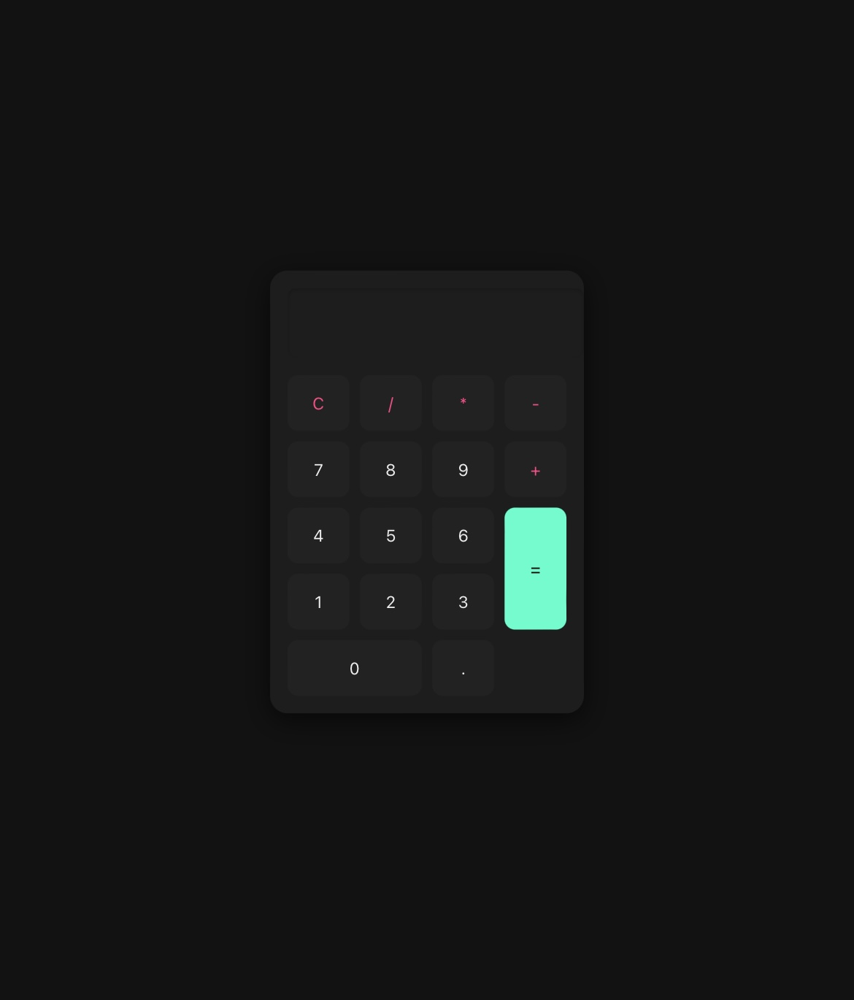

# 🖤 Dark Mode Calculator





A sleek, modern **dark mode calculator** built with **HTML, CSS, and JavaScript**.  
Supports arithmetic operations (+, −, ×, ÷), keyboard input, and a stylish UI with glassmorphism effects.

---

## ✨ Features
- Clean **dark mode** interface.
- Basic arithmetic operations.
- **Keyboard input support** (numbers, operators, Enter, Backspace, C).
- Responsive grid layout.
- Modern **glassmorphism style**.

---

## 📂 Project Structure
```txt
dark-calculator/
│── index.html   # UI
│── style.css    # Dark mode styling
│── script.js    # Calculator logic
│── README.md    # Project docs# 🖤 Dark Mode Calculator

A sleek, modern **dark mode calculator** built with **HTML, CSS, and JavaScript**.  
Supports arithmetic operations (+, −, ×, ÷), keyboard input, and a stylish UI with glassmorphism effects.

---

## ✨ Features
- Clean **dark mode** interface.
- Basic arithmetic operations.
- **Keyboard input support** (numbers, operators, Enter, Backspace, C).
- Responsive grid layout.
- Modern **glassmorphism style**.

---

## 📂 Project Structure
```txt
dark-calculator/
│── index.html   # UI
│── style.css    # Dark mode styling
│── script.js    # Calculator logic
│── README.md    # Project docs

🚀 Getting Started
	1.	Clone this repository:
	
	git clone https://github.com/ne0c0der/dark-calculator.git
cd dark-calculator

2.	Open index.html in your browser.
3.	Enjoy calculating in style 😎
🛠 Usage
	•	Click buttons or type with your keyboard.
	•	Press C (button or key) to clear.
	•	Press Enter to evaluate.
	•	Press Backspace to delete last entry.

⸻

📜 License

MIT License — free for personal and commercial use.
